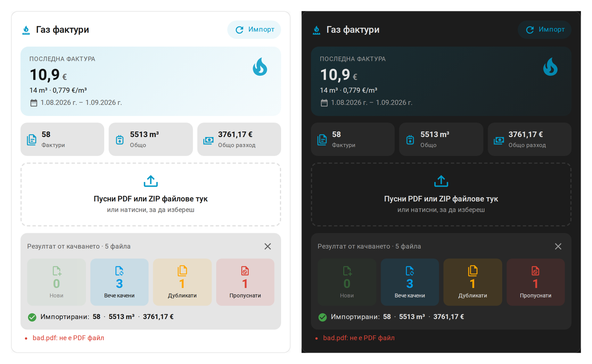
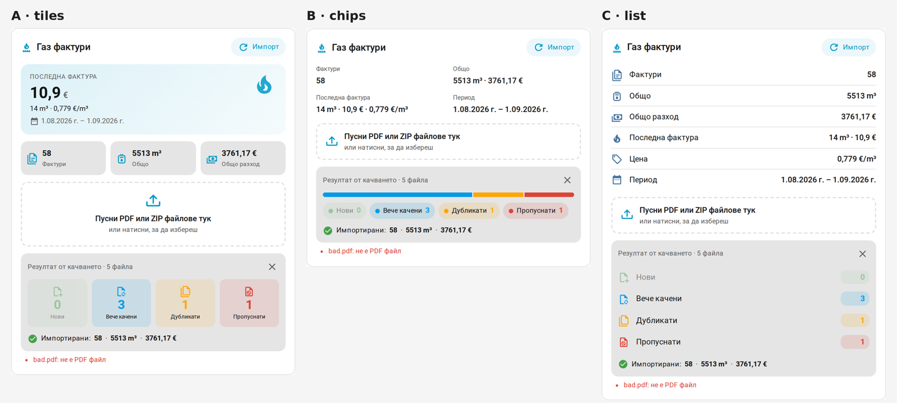
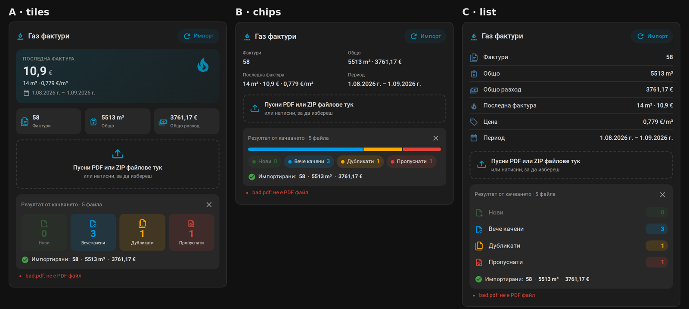

# 🔥 Gas Invoices for Home Assistant

[![hacs][hacs-badge]][hacs-url]
[![release][release-badge]][release-url]
[![validate][validate-badge]][validate-url]
[![license][license-badge]][license-url]
![Home Assistant][ha-badge]

Track your **natural gas consumption and cost** in the Home Assistant **Energy dashboard**, with no gas meter sensor, straight from the PDF invoices of your gas supplier.



## What is Gas Invoices?

Your gas invoice arrives weeks after the billing period ends. Gas Invoices reads the PDF and extracts the billing period, meter readings, volume (m³), calorific value and amount due. It then **back-fills Home Assistant's long-term statistics for the actual days of the billing period**, not the day the invoice arrived. The Energy dashboard shows gas the same way it shows electricity: by day, month and year, with cost.

> **Supported suppliers:** КОСТИНБРОДГАЗ ООД (Kostinbrod, Bulgaria), all invoice layouts since 2021: BGN only, BGN with 2022 government compensation, dual EUR/BGN, and EUR only.
> Your supplier is missing? **[Add your supplier](#-add-your-supplier)**. It takes 2 minutes and no personal data leaves your home.

### Features

- 🖱️ **Drag & drop upload:** drop many PDFs or ZIPs onto the dashboard card, no YAML needed.
- 📊 **Energy dashboard ready:** three statistics: `consumption` (m³), `energy` (kWh) and `cost` (€).
- 🌡️ **Realistic daily profile:** heating is spread by hourly [Open-Meteo](https://open-meteo.com/) temperatures at your location; hot water and cooking are spread evenly.
- 🧾 **Clear upload report:** new / already uploaded / duplicates / skipped, with duplicates detected by invoice number.
- 🕳️ **Gap filling:** missing invoices are filled from meter readings (the cost for those periods is estimated).
- 🔁 **Meter replacements** and **currency changes** (BGN → EUR) are handled automatically.
- 🎨 **Three card layouts:** `tiles`, `chips` and `list`, in light and dark themes.
- 🔒 **Privacy first:** invoices stay in your Home Assistant, and the diagnostics tool masks personal data before you share anything.
- 🤖 **Automation friendly:** an import button, the `gas_invoices.import_invoices` action with response, an optional nightly import, and the `gas_invoices_imported` event (for Node-RED too).
- 🌎 **English and Bulgarian** translations.

## Installation

### HACS (recommended)

Use this link to open the repository in HACS in your Home Assistant. If it isn't there yet, HACS offers to add it as a custom repository automatically:

[](https://my.home-assistant.io/redirect/hacs_repository/?owner=Myxomopka666&repository=ha-gas-invoice&category=integration)

Then click **Download** and **restart Home Assistant**.

_or add it manually:_

1. Install [HACS](https://hacs.xyz/) if you don't have it already.
2. Open HACS → ⋮ → **Custom repositories**.
3. Add `https://github.com/Myxomopka666/ha-gas-invoice` with category **Integration**.
4. Search for **Gas Invoices**, click **Download** ⬇️ and restart Home Assistant.

### Manual

1. Download the [latest release][release-url].
2. Copy `custom_components/gas_invoices` into your `config/custom_components/` folder.
3. Restart Home Assistant.

## Setup

After the restart, use this button to add the integration:

[](https://my.home-assistant.io/redirect/config_flow_start/?domain=gas_invoices)

_or_ go to **Settings → Devices & services → Add integration → Gas Invoices**.

1. Keep the default folder `/config/gas_invoices`, or point it to a network share (for example `/share/nas/...`, added under **Settings → System → Storage**).
2. Upload your invoices, either with the [dashboard card](#-dashboard-card) or from **Configure → Upload invoices** (one PDF or a ZIP). The import runs automatically.
3. Add gas to the Energy dashboard:

   [](https://my.home-assistant.io/redirect/config_energy/)

   - **Gas consumption** → **Gas consumption (invoices)** (`gas_invoices:consumption`)
   - **Costs** → *Use an entity tracking the total costs* → **Gas cost (invoices)** (`gas_invoices:cost`)

   With the Bulgarian UI the names are *Газ консумация / Газ разход (фактури)*. The cost is in EUR, so set **Settings → System → General → Currency** to Euro.

> Home Assistant writes statistics in the background. With several years of data, allow 1–2 minutes before the charts fill in.

## 🃏 Dashboard card

The card is registered automatically in **Settings → Dashboards → Resources** on startup (storage-mode dashboards). Edit a dashboard → **Add card** → search **Gas Invoices**, or use YAML:

```yaml
type: custom:gas-invoices-card
layout: tiles     # tiles (default) | chips | list
# title: My gas   (optional)
```



<details>
<summary>Dark theme</summary>



</details>

<details>
<summary>YAML-mode dashboards</summary>

If your dashboards use YAML mode, add the resource yourself:

```yaml
lovelace:
  resources:
    - url: /gas_invoices/gas-invoices-card.js
      type: module
```

</details>

Uploading from the card requires an administrator account.

## ⚙️ Options

**Settings → Devices & services → Gas Invoices → Configure → Settings**

| Option | Default | Description |
|---|---|---|
| Folder | `/config/gas_invoices` | Where invoices are stored and read from |
| Heating base temperature | 18 °C | Outdoor temperature below which heating is assumed |
| Base load | `auto` | m³/day for hot water and cooking. `auto` = lowest invoice within ±6 months |
| Fill gaps | on | Fill missing periods from meter readings (cost is estimated) |
| Distribute by temperature | on | Off = even distribution across the period |
| Nightly import | on | Re-import every night at 03:15 (useful with a network share) |

## 🤖 Actions and events

```yaml
action: gas_invoices.import_invoices
data:
  reset: false   # true = clear the statistics first (after removing an invoice)
```

Every import rebuilds the whole history from all PDFs in the folder and overwrites the existing values, so it is safe to run as often as you like. The action returns a summary (invoices, totals, gaps, warnings). The same summary is fired as the `gas_invoices_imported` event.

<details>
<summary>Entities</summary>

| Entity | Description |
|---|---|
| Last invoice consumption / energy / cost / price per m³ | Values of the latest invoice (period and number as attributes) |
| Invoices | Number of invoices; totals, gaps and warnings as attributes |
| Last import | Time of the last import |
| Import invoices (button) | Runs the import |

</details>

## 🧩 Add your supplier

Every supplier formats its invoices differently, so each one needs its own small parser. You can help **without sharing any personal data**:

1. In Home Assistant open **Settings → Devices & services → Gas Invoices → Configure → Invoice diagnostics**.
2. Choose one of your PDF invoices. The file is **not stored**. The integration only extracts its text and masks personal data: name, address, personal ID (ЕГН), customer number, phone, e-mail and IBAN.
3. Review the text. If something personal is still visible, run it again and list those words in **Also hide**.
4. Open a **[new supplier request](https://github.com/Myxomopka666/ha-gas-invoice/issues/new?template=new_supplier.yml)** and paste the text together with the expected values (m³, kWh, total).

The same is available as an action for files already in the invoice folder:

```yaml
action: gas_invoices.debug_invoice
data:
  file: 2026-01_0100123131.pdf
  mask: ["Ivan Ivanov"]
```

> ⚠️ **Never attach real PDF invoices to issues.** They contain personal data.

## 🔒 Privacy

- Invoices are stored only in the configured folder, which is not exposed via `/local`.
- The extracted text is cached in `.storage/gas_invoices.<entry_id>`.
- Temperatures are fetched from Open-Meteo using only your Home Assistant coordinates.
- Nothing else leaves your Home Assistant.

## 🛠️ Contributing

Parsers live in `custom_components/gas_invoices/suppliers/`. Each module defines `KEY`, `NAME`, `detect(text) -> bool` and `parse(text, tz, filename) -> Invoice`, and is registered in `suppliers/__init__.py`. They have no Home Assistant dependencies, so they are easy to test: add tests with anonymised text in `tests/` and run `pytest`.

## 🇧🇬 На български

**Gas Invoices** вкарва газа от PDF фактурите ти в **Energy таблото** на Home Assistant, без датчик на газомера.

- **Инсталация:** натисни бутона **„Open HACS repository“** по-горе. HACS ще добави repo-то сам. После **Download** и рестарт.
- **Настройка:** бутонът **„Add integration“** или Settings → Devices & services → Add integration → **Gas Invoices**.
- **Качване:** с drag & drop в картата `custom:gas-invoices-card`, или от **Configure → Качи фактури** (PDF или ZIP).
- **Разпределение:** консумацията и цената се разпределят по дните от периода на фактурата, според температурите.
- **Energy таблото:** Gas → „Газ консумация (фактури)“, за цената „Газ разход (фактури)“. Валутата в HA трябва да е евро.
- **Поддържани фактури:** засега Костинбродгаз, всички формати от 2021 г. насам.
- **Друг доставчик?** Configure → **Диагностика на фактура** дава текста на фактурата без лични данни. Изпрати го в [заявка за нов доставчик](https://github.com/Myxomopka666/ha-gas-invoice/issues/new?template=new_supplier.yml). **Не прикачвай PDF-а.**

## License

[MIT](LICENSE)

[hacs-badge]: https://img.shields.io/badge/HACS-Custom-41BDF5.svg?style=flat-square
[hacs-url]: https://my.home-assistant.io/redirect/hacs_repository/?owner=Myxomopka666&repository=ha-gas-invoice&category=integration
[release-badge]: https://img.shields.io/github/v/release/Myxomopka666/ha-gas-invoice?style=flat-square
[release-url]: https://github.com/Myxomopka666/ha-gas-invoice/releases/latest
[validate-badge]: https://img.shields.io/github/actions/workflow/status/Myxomopka666/ha-gas-invoice/validate.yml?branch=main&style=flat-square&label=validate
[validate-url]: https://github.com/Myxomopka666/ha-gas-invoice/actions/workflows/validate.yml
[license-badge]: https://img.shields.io/github/license/Myxomopka666/ha-gas-invoice?style=flat-square
[license-url]: LICENSE
[ha-badge]: https://img.shields.io/badge/Home%20Assistant-2025.1%2B-blue?style=flat-square&logo=home-assistant
